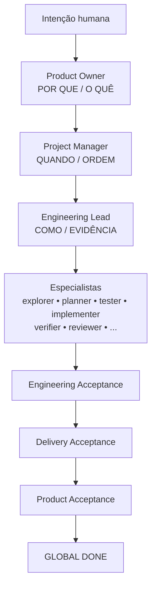
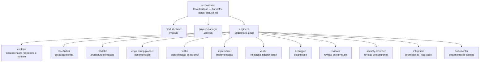
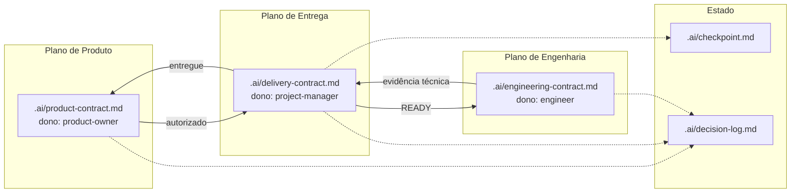
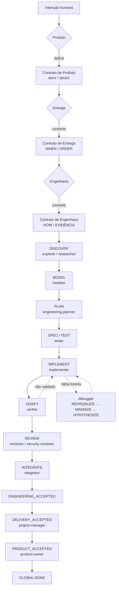
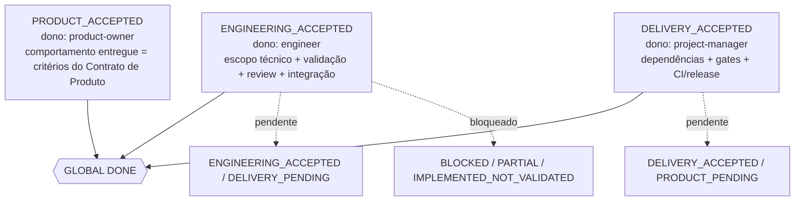
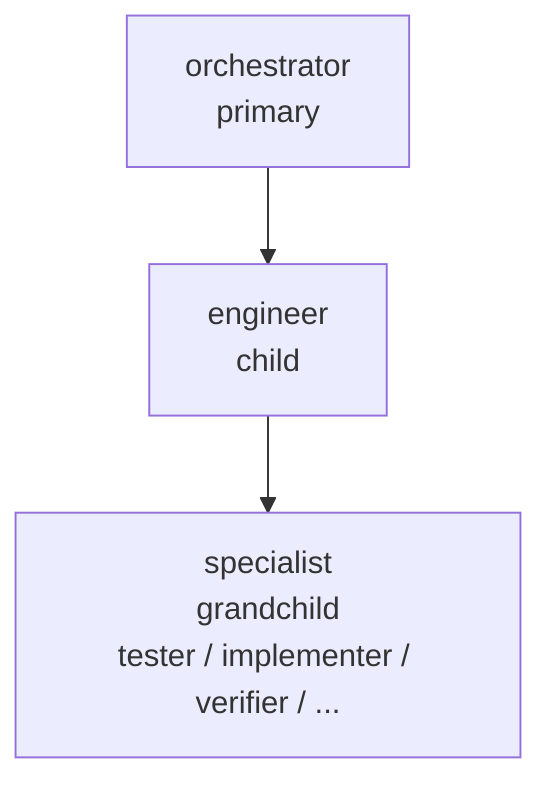

# Entrega de Produto com IA para OpenCode V2

Organização multi-plano para **Produto**, **Entrega** e **Engenharia** com contratos explícitos e gates de evidência.

Compatível com [OpenCode V2](https://opencode.ai/v2/docs/) (`opencode2`). Coexiste com os agentes nativos `build` e `plan` — este pacote define `orchestrator` como padrão sem desabilitar nenhum agente existente.

## Como funciona



A cerimônia escala com o risco: correções triviais passam direto pelo `engineer`; funcionalidades transversais usam o fluxo completo de contratos. Ciclo completo em `skills/ai-driven-engineering/SKILL.md`.

## Organização



| Plano | Agente | Responsabilidade |
|---|---|---|
| **Coordenação** | `orchestrator` | Orquestra handoffs entre planos e sintetiza o status final. Não edita código nem contratos. |
| **Produto** | `product-owner` | Define problema, outcome, valor, escopo e critérios de aceite. |
| **Entrega** | `project-manager` | Define dependências, ondas de execução, prontidão e gates de entrega. |
| **Engenharia** | `engineer` | Define contrato técnico, delega para especialistas e concede `ENGINEERING_ACCEPTED`. |

O `engineer` atua como **Engineering Lead** — delega implementação para especialistas para manter planejamento, execução e verificação independentes.

## Contratos

Contratos são a única forma de comunicação entre planos — não há suposição implícita.



| Contrato | Dono | Conteúdo |
|---|---|---|
| **Contrato de Produto** | `product-owner` | Problema, outcome, valor, stakeholders, escopo In/Out, restrições, critérios de aceite, autorização. |
| **Contrato de Entrega** | `project-manager` | Grafo de trabalho, dependências, ondas, riscos, pré-requisitos externos, gates de entrega. |
| **Contrato de Engenharia** | `engineer` | Sistema atual observado, escopo técnico, impacto arquitetural, superfícies de escrita, plano de validação. |

Templates em `skills/ai-driven-engineering/templates/`. Cada contrato possui ciclo de status próprio (ex.: Produto `DRAFT → NEEDS_HUMAN_DECISION → APPROVED → PRODUCT_ACCEPTED`).

## Ciclo de vida completo



 Gates preservados: `product-owner` e `project-manager` não chamam especialistas de código; `orchestrator` coordena como siblings.

## Triple Definition of Done

`GLOBAL DONE` só existe quando os três planos aceitam — implementação sem validação ou entrega sem aceite de produto **não** é DONE.



Estados parciais (`ENGINEERING_ACCEPTED / DELIVERY_PENDING`, `BLOCKED`, `IMPLEMENTED_NOT_VALIDATED`) são reportados explicitamente — nunca forçar confiança além da evidência.

## Requisitos

- OpenCode V2 (`opencode2`) — [instalação](https://opencode.ai/v2/docs/)
- PowerShell 5.1+ / PowerShell 7+ (Windows) ou `pwsh` (macOS/Linux)

## Instalação

Na raiz do pacote:

```powershell
powershell -ExecutionPolicy Bypass -File .\install-opencode.ps1
```

O instalador:

1. Copia os agentes para `~/.config/opencode/agents/`
2. Copia a skill para `~/.config/opencode/skills/ai-driven-engineering/`
3. Cria backup com timestamp de `opencode.json` / `opencode.jsonc`
4. Define `default_agent: "orchestrator"`
5. Define `experimental.subagent_depth: 2` (necessário para `orchestrator → engineer → specialist`)
6. Preserva providers, modelos e definições de MCP existentes

Opções:

```powershell
# Apenas agentes e skill, sem alterar config
.\install-opencode.ps1 -NoConfigPatch

# Mantém o default_agent atual
.\install-opencode.ps1 -NoDefaultAgent
```

Reinicie o OpenCode após instalar para que a descoberta recarregue os novos agentes e a skill.

Para remover:

```powershell
powershell -ExecutionPolicy Bypass -File .\uninstall-opencode.ps1
```

## Bootstrap do projeto

Inicializa os templates de contrato em qualquer projeto:

```powershell
# Cria .ai/ no projeto atual (não sobrescreve existentes)
powershell -ExecutionPolicy Bypass -File <pacote>\scripts\bootstrap-project.ps1

# Sobrescreve arquivos existentes
powershell -ExecutionPolicy Bypass -File <pacote>\scripts\bootstrap-project.ps1 -Force
```

Estrutura criada:

```
.ai/
├── product-contract.md        Contrato de Produto
├── delivery-contract.md       Contrato de Entrega
├── engineering-contract.md    Contrato de Engenharia
├── checkpoint.md              Estado da entrega
└── decision-log.md            Decisões entre planos
```

Use `bootstrap` quando for iniciar um delivery estruturado. Para correções triviais, chame `engineer` ou `build` direto sem `.ai`.

## Roteamento no OpenCode V2

O aninhamento ponta a ponta exige profundidade 2:



```json
{
  "experimental": {
    "subagent_depth": 2
  }
}
```

`product-owner`, `project-manager` e `engineer` usam `mode: all` e podem ser selecionados diretamente no TUI. `orchestrator` é `mode: primary`; especialistas são `mode: subagent`.

## Agentes nativos

Este pacote **não desabilita** `build` ou `plan`. Ambos continuam disponíveis — troque de agente no TUI ou defina `default_agent` de volta para `build` se preferir. Veja o [guia de Agents](https://opencode.ai/v2/docs/agents).

| Agente nativo | Uso recomendado |
|---|---|
| `build` | Codificação rápida, sem cerimônia |
| `plan` | Planejamento sem implementação (gera `plan/*.md`) |
| `orchestrator` | Delivery ponta a ponta com contratos (padrão deste pacote) |

## Modelos e MCPs

A configuração de providers e MCPs **não é alterada**. Seleção de modelos e roteamento de MCPs são adaptadores sobre a organização e podem ser ajustados por papel sem mudar os contratos.

Exemplos de roteamento (configuração por projeto): design/UI → `implementer`/`verifier`; browser/E2E → `verifier`; infra/cloud → `integrator`; docs → `researcher`/`documenter`; gestão de projeto → `project-manager`.

A skill funciona corretamente mesmo sem nenhum MCP instalado.

## Desinstalação

Remove agentes e skill instalados. Chaves de configuração (`default_agent` / `subagent_depth`) não são revertidas automaticamente — restaure a partir do backup com timestamp se necessário.

## Licença

MIT — veja [LICENSE](LICENSE).
